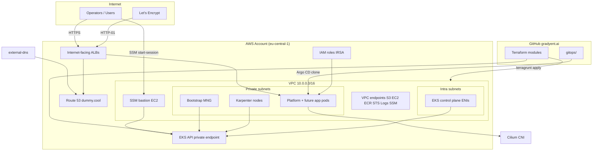
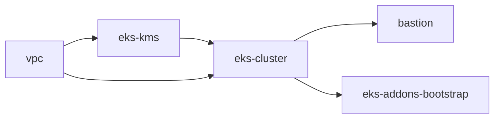
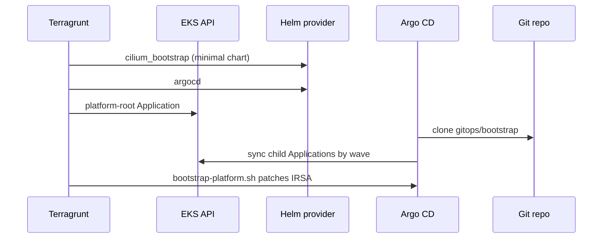

# Platform architecture

Gradyent production Kubernetes is an **AWS EKS** cluster (`gradyent-prod`, `eu-central-1`) provisioned with **Terragrunt/Terraform** and extended with a **CNCF platform stack** reconciled by **Argo CD** from this repository. The design separates **cloud foundation** (VPC, control plane, IAM) from **platform software** (CNI, autoscaling, security, observability, ingress).

This document is the entry point. Deep dives:

| Document | Topics |
|----------|--------|
| [networking.md](networking.md) | VPC layout, Cilium, ingress, DNS, TLS |
| [security.md](security.md) | Private API, bastion, IRSA, Kyverno, Falco |
| [operations.md](operations.md) | Terragrunt stacks, deploy/destroy, bootstrap sequence |
| [components.md](components.md) | Every platform app, sync wave, namespaces |
| [runbooks/](runbooks/) | Alert response playbooks |
| [cluster-test.md](cluster-test.md) | Post-deploy validation checklist |

---

## Design goals

| Goal | How it is achieved |
|------|-------------------|
| **Reproducible infra** | Terragrunt live stacks, S3 remote state, DynamoDB locks |
| **Declarative platform** | GitOps under `gitops/`; Argo CD sync waves order dependencies |
| **Least exposure** | Private EKS API; operators use **SSM Session Manager** (no SSH) |
| **Observable platform** | Prometheus/Grafana, Hubble, Jaeger, Fluentd → CloudWatch |
| **Secure defaults** | Kyverno enforce policies, Falco runtime rules, non-root workloads |
| **No app workloads here** | This repo is **platform only**; business apps use another repo/App |

---

## High-level diagram



---

## Responsibility split (Terraform vs Argo CD)

| Layer | Tool | Owns |
|-------|------|------|
| **Cloud foundation** | Terragrunt | VPC, KMS, EKS cluster, bootstrap node group, EKS add-ons (CoreDNS, EBS CSI), Karpenter **AWS** primitives (node IAM, SQS), **IRSA** roles, SSM bastion |
| **Control plane install** | Terraform (`eks-addons-bootstrap`) | Cilium bootstrap Helm, Argo CD Helm, `AppProject/platform`, `platform-root`, IRSA ConfigMap, optional platform bootstrap waiter |
| **CNCF platform** | Argo CD | Karpenter controller, Cilium (full config), ACM + LBC, external-dns, Kyverno, Falco, Istio, Prometheus stack, Jaeger, Fluentd |

**Rule of thumb:** If it is an AWS API resource or the cluster/API itself → Terraform. If it is a Kubernetes workload/chart → Argo CD (after Argo exists).

---

## Repository layout

```
gradyent.ai/
├── environments/prod/          # Terragrunt live stacks
│   ├── vpc/
│   ├── eks-kms/
│   ├── eks-cluster/
│   ├── bastion/
│   └── eks-addons-bootstrap/
├── modules/                    # Terraform modules
│   ├── vpc/
│   ├── eks-cluster/
│   ├── eks-addons-bootstrap/
│   └── bastion/
├── gitops/
│   ├── bootstrap/              # Argo CD Applications (App-of-Apps)
│   ├── apps/                   # Helm/Kustomize per component
│   └── policies/               # Kyverno ClusterPolicies
├── docs/                       # Architecture & runbooks
└── root.hcl                    # Remote state, providers, tags
```

Configuration that must stay aligned:

| File | Purpose |
|------|---------|
| [`environments/prod/env.hcl`](../environments/prod/env.hcl) | `cluster_name`, `eks_version`, `platform_domain`, `gitops_repo_url` |
| [`gitops/bootstrap/repo.env`](../gitops/bootstrap/repo.env) | Argo CD repo URL + branch |
| [`gitops/bootstrap/platform-dns.env`](../gitops/bootstrap/platform-dns.env) | `platformDomain` for generators |

---

## Terragrunt stack dependency graph



| Stack | Module | Key outputs / effects |
|-------|--------|---------------------|
| `vpc` | `modules/vpc` | VPC, public/private/intra subnets, NAT per AZ, VPC endpoints |
| `eks-kms` | KMS key | Cluster secret encryption |
| `eks-cluster` | `modules/eks-cluster` | EKS 1.35, private API, bootstrap MNG, IRSA roles, Karpenter AWS |
| `bastion` | `modules/bastion` | SSM-only EC2, EKS access entry (cluster admin) |
| `eks-addons-bootstrap` | `modules/eks-addons-bootstrap` | Cilium bootstrap, Argo CD, GitOps bootstrap |

See [operations.md](operations.md) for apply order, private API constraints, and destroy behavior.

---

## GitOps bootstrap flow

Two mechanisms install the platform:

1. **Terraform** creates `platform-root` Application → points at `gitops/bootstrap/`.
2. **`bootstrap-platform.sh`** (optional on apply) patches IRSA ARNs onto Helm apps and waits for sync.



Child Applications are listed in [components.md](components.md).

---

## Argo CD sync waves

Lower waves run first. Within the same wave, order is not guaranteed.

| Wave | Applications |
|------|----------------|
| **-1** | metrics-server |
| **0** | karpenter |
| **1** | cilium |
| **2** | aws-load-balancer-controller, external-dns, kyverno, kyverno-policies, falco |
| **3** | istio-base, istiod |
| **4** | fluentd, kube-prometheus-stack, jaeger |

**Note:** Terraform installs a **minimal Cilium** release before Argo CD because the cluster has no `vpc-cni` add-on. Wave 1 upgrades Cilium with full values from `gitops/apps/cilium/`.

---

## Platform DNS and ingress

Public hostname zone: **`dummy.cool`** (`platform_domain`).

| URL | Component |
|-----|-----------|
| https://grafana.dummy.cool | Grafana |
| https://alertmanager.dummy.cool | Alertmanager |
| https://argocd.dummy.cool | Argo CD |
| https://jaeger.dummy.cool | Jaeger |
| https://hubble.dummy.cool | Cilium Hubble UI |

- **AWS Load Balancer Controller** — `IngressClass` `alb`, internet-facing ALBs.
- **ACM** — Wildcard cert for `platform_domain`; attached to public ALB Ingresses via `alb.ingress.kubernetes.io/certificate-arn`.
- **external-dns** — Route 53 `A`/`AAAA` (alias) records, `policy: sync`.

Details: [networking.md](networking.md).

---

## Security summary

| Control | Implementation |
|---------|----------------|
| API server | Private endpoint only; no public Kubernetes API |
| Operator access | SSM bastion + EKS access entry; no SSH |
| Pod hardening | Kyverno `Enforce` policies on app namespaces |
| Runtime threats | Falco + Falcosidekick → Slack |
| Workload identity | IRSA per controller (Karpenter, LBC, external-dns, Fluentd, Falco) |
| Secrets encryption | EKS KMS encryption for Kubernetes Secrets |

Details: [security.md](security.md).

---

## Observability

| Signal | Source | Destination |
|--------|--------|-------------|
| Metrics | kube-prometheus-stack, ServiceMonitors | Prometheus → Grafana |
| Network flows | Cilium Hubble | Hubble UI + Prometheus metrics |
| Traces | Jaeger (in-memory) | Jaeger UI |
| Logs | Fluentd DaemonSet | CloudWatch `/eks/gradyent-prod/*` |
| Alerts | Prometheus rules | Alertmanager → Slack / PagerDuty |
| Runtime | Falco | Falcosidekick → Slack |

Dashboards are vendored under `gitops/apps/kube-prometheus-stack/dashboards/`.

---

## What this repo does not deploy

- Frontend, backend, or API microservices
- Application databases or queues
- Per-tenant namespaces for product workloads

Add those via a **separate Git repository** and register new Argo CD `Application` resources (or a separate App-of-Apps). Kyverno policies in `gitops/policies/` are intended to apply to those workloads when they run in non-platform namespaces.

---

## CI validation

| Workflow | Checks |
|----------|--------|
| `infra-ci.yml` | Terragrunt validate on live stacks |
| `gitops-ci.yml` | `kubectl kustomize` (incl. Helm), kubeconform on manifests |

---

## Quick start (operators)

```bash
export AWS_PROFILE=cirevo
export TERRAGRUNT_NON_INTERACTIVE=true
export TF_IN_AUTOMATION=true

cd environments/prod
terragrunt run-all apply -auto-approve
```

Push this repo to `gitops_repo_url` **before** `eks-addons-bootstrap` apply. For private API access, run bootstrap from the SSM bastion or VPN — see [operations.md](operations.md).

Day-to-day platform changes: edit `gitops/apps/<name>/`, push `main`, Argo CD syncs.

---

## Related reading

- [README.md](../README.md) — prerequisites, troubleshooting, secrets to replace
- [Cilium vs VPC CNI](https://docs.cilium.io/) — why Cilium is the sole CNI here
- [Karpenter](https://karpenter.sh/) — node autoscaling
- [Argo CD sync waves](https://argo-cd.readthedocs.io/en/stable/user-guide/sync-waves/)
