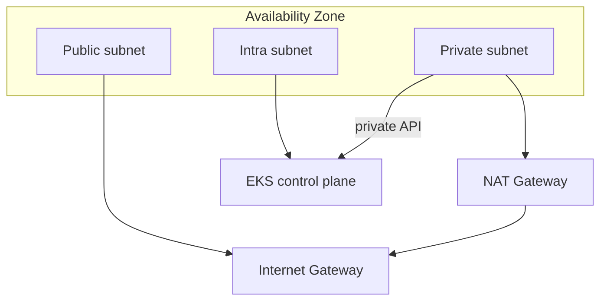
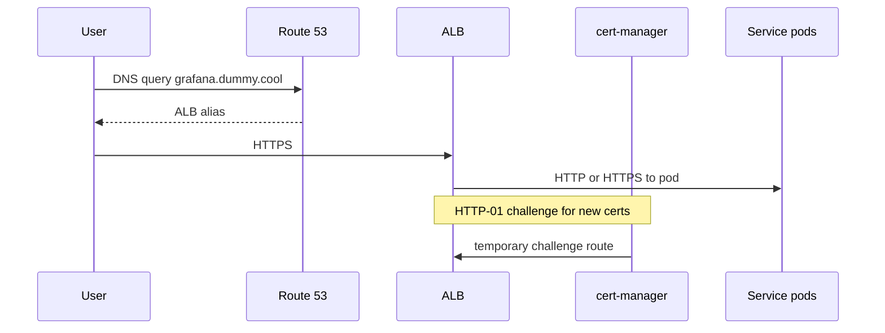

# Networking architecture

This document describes how traffic and addresses work in the Gradyent production EKS platform: VPC layout, Cilium as the sole CNI, ingress to public UIs, and DNS/TLS automation.

---

## VPC topology

**Region:** `eu-central-1`  
**CIDR:** `10.0.0.0/16` (from [`environments/prod/env.hcl`](../environments/prod/env.hcl))  
**AZs:** 3 (spread across available zones)

Subnet layout per AZ (see [`modules/vpc/main.tf`](../modules/vpc/main.tf)):

| Tier | CIDR pattern | Purpose | Routing |
|------|--------------|---------|---------|
| **Public** | `/20` per AZ | Internet-facing ALBs (via LBC) | Internet gateway |
| **Private** | `/20` per AZ | Worker nodes (bootstrap MNG, Karpenter), bastion | NAT gateway (one per AZ) |
| **Intra** | `/20` per AZ | EKS control plane ENIs only | Isolated (no NAT/IGW) |

### Subnet tags (Kubernetes integration)

| Tag | Subnets | Effect |
|-----|---------|--------|
| `kubernetes.io/cluster/gradyent-prod=shared` | All | Cluster association |
| `kubernetes.io/role/elb=1` | Public | Internet-facing ALB placement |
| `kubernetes.io/role/internal-elb=1` | Private | Internal ALB placement |
| `karpenter.sh/discovery=gradyent-prod` | Private | Karpenter subnet selection |

Worker nodes and the control plane use **private + intra** subnets only (`modules/eks-cluster/main.tf` concatenates them for the cluster data plane).

---

## VPC endpoints

To reduce reliance on NAT for AWS API calls, the VPC module provisions:

| Type | Services |
|------|----------|
| **Gateway** | S3 |
| **Interface** (private subnets) | EC2, ECR API, ECR DKR, STS, CloudWatch Logs, **SSM**, **ssmmessages**, **ec2messages** |

SSM endpoints allow the bastion to register with Session Manager without sending management traffic over the public internet.

---

## EKS API connectivity

| Setting | Value |
|---------|--------|
| `cluster_endpoint_public_access` | `false` |
| `cluster_endpoint_private_access` | `true` |

The Kubernetes API is reachable only from within the VPC (or connected networks: VPN, Direct Connect, etc.). Operators use the **SSM bastion** or another VPC-connected host for `kubectl` and for Terraform’s Kubernetes/Helm providers during `eks-addons-bootstrap`.

The API server hostname resolves to **private IPs** inside the VPC.

---

## Cilium (sole CNI)

AWS **vpc-cni** and **kube-proxy** EKS add-ons are **not** installed. Cilium provides:

- Pod networking (ENI IPAM — pods get VPC-routable IPs)
- Network policy
- Kubernetes Service load-balancing (`kubeProxyReplacement: true`)
- Hubble observability

Configuration: [`gitops/apps/cilium/values.yaml`](../gitops/apps/cilium/values.yaml)

| Setting | Meaning |
|---------|---------|
| `cni.exclusive: true` | Only Cilium manages pod interfaces |
| `ipam.mode: eni` | AWS ENI-based IP allocation (similar semantics to VPC CNI) |
| `routingMode: native` | Native routing (no overlay tunnel between nodes in VPC) |
| `eni.enabled: true` | AWS ENI integration |
| `kubeProxyReplacement: true` | No kube-proxy DaemonSet |

### Bootstrap vs GitOps Cilium

On a **new** cluster, pods cannot run until a CNI exists. [`modules/eks-addons-bootstrap/cilium-bootstrap.tf`](../modules/eks-addons-bootstrap/cilium-bootstrap.tf) installs a minimal Cilium Helm release **before** Argo CD. Argo CD wave 1 then reconciles the full chart (Hubble, metrics, ingress, etc.).

### Hubble

- **Relay + UI** enabled in-cluster
- UI exposed at `https://hubble.dummy.cool` via Ingress ([`gitops/apps/cilium/manifests/hubble-ingress.yaml`](../gitops/apps/cilium/manifests/hubble-ingress.yaml))
- Flow/DNS/TCP/HTTP metrics scraped by Prometheus

---

## Ingress path (north-south)

Public platform UIs use the same pattern:

| Component | Role |
|-----------|------|
| **AWS Load Balancer Controller** | Watches `Ingress` with `ingressClassName: alb`; creates ALB + target groups |
| **cert-manager** | Issues TLS certs via Let's Encrypt HTTP-01 (`ingress.class: alb`) |
| **external-dns** | Creates/updates Route 53 records from Ingress hostnames |
| **Ingress annotations** | Scheme `internet-facing`, target-type `ip`, SSL redirect, optional health checks |

Example annotations (Grafana): [`gitops/apps/kube-prometheus-stack/values.yaml`](../gitops/apps/kube-prometheus-stack/values.yaml)

### Argo CD TLS model

Argo CD is **not** run with `server.insecure`. The server presents a **cert-manager-issued certificate**; the ALB uses `backend-protocol: HTTPS` to the Argo CD server pod. TLS is terminated at the ALB for clients; the hop ALB → Argo CD is also encrypted.

---

## DNS (external-dns)

| Setting | Value |
|---------|--------|
| Domain filter | `dummy.cool` |
| Policy | `sync` (prune records no longer in cluster) |
| TXT owner | `gradyent-prod` |
| Sources | `ingress`, `service` |

**Prerequisite:** A public Route 53 hosted zone for `dummy.cool` in the same AWS account.

IRSA role: `gradyent-prod-external-dns` (Terraform). Role ARN patched at bootstrap onto the Argo CD Application.

Manual CNAMEs are **not** required once external-dns is healthy.

---

## East-west traffic (Istio)

**Istio** (waves 3) installs the control plane (`istio-base`, `istiod`) for future mesh features. Application workloads added later can inject sidecars; platform namespaces are not required to use Istio for basic ingress (ALB → Service is sufficient for UIs).

Service mesh policy and mTLS between apps are out of scope until application workloads are onboarded.

---

## Karpenter node networking

Karpenter provisions EC2 instances into **private subnets** tagged `karpenter.sh/discovery=gradyent-prod`. Node security groups carry the same discovery tag. See [`gitops/apps/karpenter/manifests/ec2nodeclass.yaml`](../gitops/apps/karpenter/manifests/ec2nodeclass.yaml).

- **AMI:** `al2023@latest`
- **IMDSv2:** required (`httpTokens: required`)
- **Root volume:** 80 Gi gp3 encrypted

---

## IP capacity planning

With ENI-mode CNIs (Cilium ENI or legacy VPC CNI), each instance type has limits on **secondary IPs / ENIs**. Dense clusters may need:

- Larger instance types
- [Prefix delegation](https://docs.cilium.io/en/stable/network/concepts/ipam/eni.html) (Cilium ENI mode supports scaling patterns documented upstream)
- Right-sized `maxPods` per node

Monitor IP allocation via Hubble/Cilium metrics and CloudWatch node metrics.

---

## Troubleshooting

| Symptom | Checks |
|---------|--------|
| Pods stuck `ContainerCreating` | `kubectl -n kube-system get pods -l k8s-app=cilium`; CNI not ready |
| Ingress no ADDRESS | LBC logs, IRSA role, subnet tags for ALB |
| DNS not updating | `kubectl -n kube-system logs deploy/external-dns` |
| Cert not issued | `kubectl describe certificate`, HTTP-01 reachable on ALB |
| No API access from laptop | Expected with private API — use bastion SSM session |

See also [operations.md](operations.md) and [README.md](../README.md).
