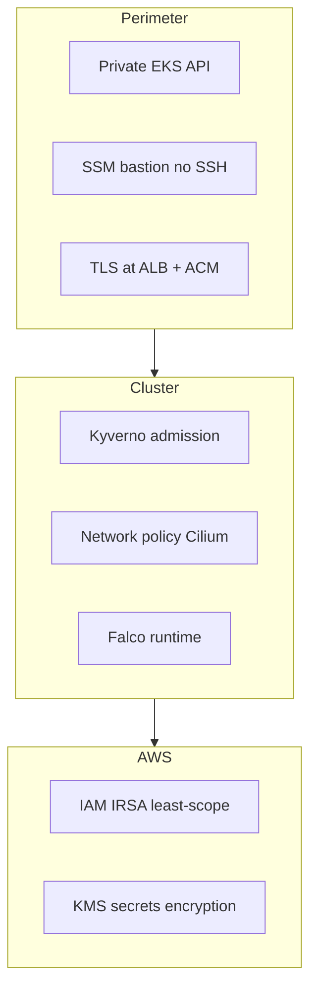

# Security architecture

How the Gradyent platform enforces access control, workload hardening, and runtime detection. Complements [networking.md](networking.md) (private API, bastion) and [components.md](components.md) (Falco, Kyverno).

---

## Security layers (defense in depth)



| Layer | Control |
|-------|---------|
| **Identity (humans)** | IAM + SSM Session Manager; EKS access entries (bastion role) |
| **Identity (workloads)** | IRSA — no long-lived cloud credentials in pods |
| **Control plane** | Private API endpoint; secrets encrypted with KMS |
| **Admission** | Kyverno `Enforce` policies |
| **Runtime** | Falco rules + Falcosidekick notifications |
| **Network** | Cilium policy; optional Istio mTLS for apps later |
| **Ingress** | HTTPS only (redirect), public UIs on known hostnames |

---

## Private Kubernetes API

Configured in [`modules/eks-cluster/main.tf`](../modules/eks-cluster/main.tf) and [`environments/prod/eks-cluster/terragrunt.hcl`](../environments/prod/eks-cluster/terragrunt.hcl):

- `cluster_endpoint_public_access = false`
- `cluster_endpoint_private_access = true`

**Implications:**

- `kubectl` and Terraform Helm/Kubernetes providers must run from **inside the VPC** (bastion, CI runner in VPC, or VPN).
- `aws eks update-kubeconfig` on a home laptop **will not** reach the API unless you add network connectivity.

`enable_cluster_creator_admin_permissions = true` grants the IAM principal that **created** the cluster admin via EKS access API; it does not automatically grant your entire org.

---

## SSM bastion (no SSH)

Module: [`modules/bastion/`](../modules/bastion/)

| Property | Value |
|----------|--------|
| Access | **AWS Systems Manager Session Manager only** |
| SSH | Disabled — no key pair, no TCP/22 on security group |
| Placement | First private subnet |
| Instance | Amazon Linux 2023, IMDSv2 required |
| EKS access | `AmazonEKSClusterAdminPolicy` on bastion IAM role via EKS access entry |

### Operator requirements

Your IAM user/role needs at minimum:

- `ssm:StartSession` on the bastion instance (and typically `ssm:DescribeInstanceInformation`)
- Standard permissions to call `aws ssm start-session`

On the bastion, `kubectl` and `aws eks update-kubeconfig` are preconfigured via user-data.

```bash
cd environments/prod/bastion
terragrunt output ssm_start_session_command
```

### Why a bastion instead of public API?

- Shrinks attack surface (no anonymous internet scans on `:443` of the Kubernetes API).
- Session Manager provides **auditable, IAM-gated** shell access without managing SSH keys or bastion SSH security groups.

---

## IAM and IRSA

EKS OIDC provider enables **IAM Roles for Service Accounts**. Terraform creates roles in [`modules/eks-cluster/irsa.tf`](../modules/eks-cluster/irsa.tf); bootstrap patches ARNs onto Argo CD Helm Applications.

| IAM role (pattern) | Service account | Capability |
|--------------------|-----------------|------------|
| `gradyent-prod-karpenter-controller` | `karpenter:karpenter` | Node lifecycle, SQS interruption queue |
| `gradyent-prod-aws-load-balancer-controller` | `kube-system:aws-load-balancer-controller` | ALB/NLB management |
| `gradyent-prod-external-dns` | `kube-system:external-dns` | Route 53 record changes |
| `gradyent-prod-fluentd` | `logging:fluentd` | CloudWatch Logs write |
| `gradyent-prod-falco` | `falco:falco` | Optional CloudWatch metrics |
| `gradyent-prod-ebs-csi-*` | `kube-system:ebs-csi-controller-sa` | EBS volumes (EKS add-on) |

IRSA metadata is also stored in ConfigMap `gradyent-irsa-roles` in `argocd` for reference.

**Karpenter node role** (`gradyent-prod-karpenter-node`) is a separate EC2 instance profile role, not IRSA.

---

## Secrets encryption

EKS **envelope encryption** for Kubernetes Secrets uses a dedicated KMS key from the `eks-kms` Terragrunt stack (`cluster_encryption_config` in the EKS module).

Application secrets (Grafana admin, Alertmanager webhooks, Falcosidekick) are Kubernetes `Secret` objects in Git with **placeholder values** — replace before production ([README.md](../README.md)).

---

## Kyverno (admission policy)

Policies live in [`gitops/policies/`](../gitops/policies/). All use `validationFailureAction: Enforce`.

| Policy | Intent |
|--------|--------|
| `disallow-privileged-containers` | No privileged pods |
| `disallow-privilege-escalation` | Block escalation |
| `disallow-host-namespaces` | No host PID/network/IPC |
| `disallow-host-path` | No hostPath volumes |
| `disallow-latest-tag` | Require explicit image tags |
| `require-run-as-non-root` | Non-root UIDs |
| `require-requests-limits` | CPU/memory requests and limits |
| `drop-all-capabilities` / `restrict-capabilities` | Capability dropping |
| `require-pod-probes` | Liveness/readiness probes |
| `disallow-default-namespace` | No workloads in `default` |

### Excluded namespaces (platform)

Platform stacks are excluded from most policies so daemonsets and controllers can run:

`kube-system`, `kyverno`, `argocd`, `karpenter`, `istio-system`, `cilium-secrets`, `cert-manager`, `monitoring`, `observability`, `logging`, `falco`

**Application namespaces** you create later (e.g. `production`, `staging`) are **not** excluded — new workloads must comply.

Sync wave **2** (`kyverno-policies`) applies after Kyverno controller is running.

---

## Falco (runtime security)

Deployed from [`gitops/apps/falco/`](../gitops/apps/falco/). Falco monitors syscalls and Kubernetes audit events.

Custom rules (examples):

- Shell in containers
- Unexpected exec binaries
- Sensitive file reads
- Cryptominer-style network behavior

**Falcosidekick** forwards alerts to Slack (`#platform-alerts-falco`). Configure webhook in secret `falcosidekick-notification-secrets`.

Falco runs privileged in `falco` namespace (excluded from Kyverno privileged checks).

---

## Ingress and TLS

- Clients → **HTTPS** on ALB (TLS 1.2+ at edge).
- Certificates from **Let's Encrypt** (production issuer).
- HTTP-01 challenges require ALB to route port 80 for challenge paths.

Restrict who can modify `Ingress` in production via RBAC; compromised ingress could point DNS (external-dns) to attacker-controlled endpoints if RBAC is weak.

---

## Argo CD

- Installed by Terraform; UI at `https://argocd.dummy.cool`.
- Git repo credentials (if private) via `credentialTemplates` in Terraform variables.
- `AppProject/platform` allows cluster-scoped resources for platform sync.
- **Change** default Argo CD admin password after install (not documented in Git — retrieve initial secret from `argocd-initial-admin-secret`).

---

## Compliance-oriented notes

This platform provides **technical controls** commonly used for SOC2/ISO-style programs; certification itself is an organizational process. Evidence sources:

- CloudTrail (AWS API), Session Manager session logs
- Falco / Alertmanager / Grafana audit trails
- Git history for GitOps changes
- Terraform state access controls on S3/DynamoDB

---

## Hardening checklist (production)

- [ ] Replace Grafana, Alertmanager, Falcosidekick placeholder secrets
- [ ] Restrict IAM who can `ssm:StartSession` to the bastion
- [ ] Restrict EKS access entries for human admins (separate from bastion if needed)
- [ ] Enable AWS GuardDuty / Security Hub (account level — not in this repo)
- [ ] Review Kyverno exclusions before onboarding app namespaces
- [ ] Configure Argo CD SSO (Dex/OIDC) — optional future improvement
- [ ] Rotate Let's Encrypt and webhook credentials on schedule
